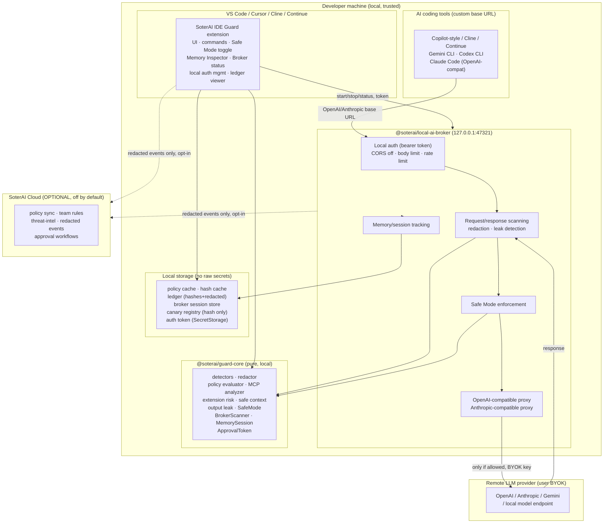
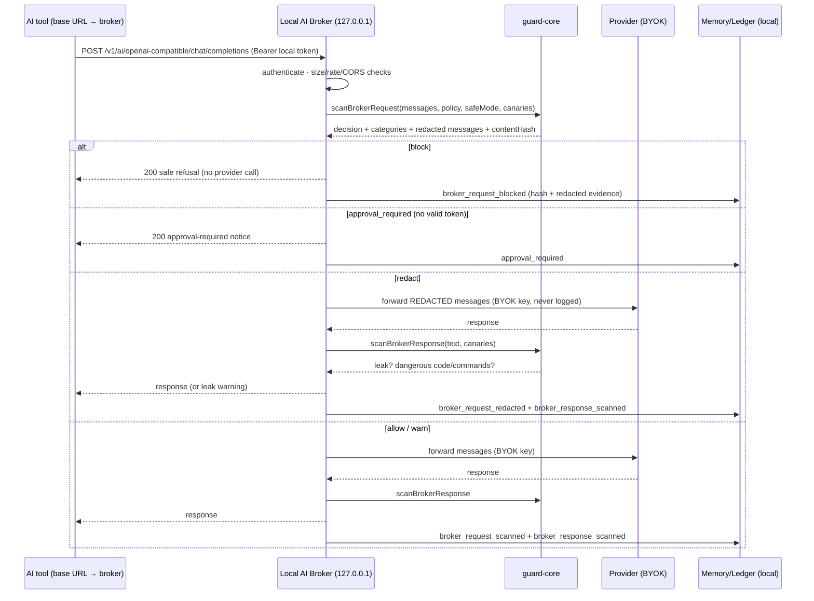

# SoterAI Local AI Broker — Architecture

**Status:** implemented local MVP for v0.2.0 (Local AI Broker + AI Safe Mode + AI Memory Inspector)
**Date:** 2026-07-05
**Scope note (honest):** SoterAI can fully inspect and enforce AI traffic **routed through** the
Local AI Broker, the Safe Context Builder, or an explicit SoterAI scan. It **cannot** guarantee
inspection of AI traffic that bypasses these — a VS Code extension cannot intercept every other
extension's internal file reads, prompts, or network calls. See
[broker-limitations.md](./broker-limitations.md).

## 1. Components

### 1.1 VS Code Extension
UI, commands, project policy, **Safe Mode toggle**, **Memory Inspector UI**, broker status bar,
local auth token management (SecretStorage), Safe Context Builder entry points, ledger viewer.

### 1.2 SoterAI Local AI Broker (`@soterai/local-ai-broker`)
Local Node/TypeScript HTTP service bound to `127.0.0.1` only. Authenticated local API,
OpenAI-compatible proxy, Anthropic-compatible proxy, local policy enforcement, local redaction,
request/response scanning, output-leak detection, memory/session tracking, batched **redacted**
events. **No cloud by default.**

### 1.3 guard-core (`@soterai/guard-core`)
Pure, dependency-light engine reused by both the extension and the broker: detectors, redactor,
policy evaluator, MCP analyzer, extension risk scanner, safe context builder, output-leak monitor,
and the new **SafeMode**, **BrokerScanner**, **MemorySession**, and **ApprovalToken** modules.

### 1.4 Local storage
Policy cache, hash cache, ledger (hashes + redacted previews), broker session store, canary
registry (**hash only**), local auth token (SecretStorage in the IDE; file mode `0600` for the
standalone broker). **No raw secret storage anywhere.**

### 1.5 Optional cloud
Policy sync, team rules, threat-intel rules, redacted events, approval workflows. **Disabled by
default.** Raw content, prompts, and secrets never leave the machine by default.

## 2. Data flow — brokered AI request

## 3. Trust boundaries

| Boundary | Trusted side | Untrusted side | Control |
| --- | --- | --- | --- |
| Loopback socket | broker process | any local process that lacks the token | bearer token, 127.0.0.1 bind, CORS off |
| Browser origin | native tools | web pages trying SSRF/DNS-rebind to localhost | `Origin`/`Sec-Fetch` rejection, no CORS |
| Provider egress | user's BYOK provider | — | only forwarded when policy allows; key masked in logs |
| Cloud sync | local device | SoterAI Cloud | opt-in only; redacted events only; raw never sent |
| Workspace files | SoterAI-built/brokered context | other extensions reading files directly | **out of scope** — documented limitation |

## 4. Local vs cloud responsibilities

| Responsibility | Local (default) | Cloud (opt-in) |
| --- | --- | --- |
| Scanning / redaction / decisions | ✅ always local | never |
| Provider forwarding (BYOK) | ✅ local→provider | never proxied via cloud |
| Ledger / memory store | ✅ local, redacted | never |
| Policy authoring | ✅ local file | optional sync of **rules** (not content) |
| Team rules / threat intel | — | optional pull |
| Redacted event aggregation | ✅ local queue | optional push (redacted only) |

## 5. Threat model (STRIDE-ish)

| Threat | Vector | Mitigation |
| --- | --- | --- |
| Secret exfiltration to provider | prompt contains `.env`, keys, PII | request scan → redact/block; Safe Mode blocks protected patterns |
| Canary/protected context leak | AI read protected file, echoes it | canary matching in request + response; canary hit = CRITICAL block |
| Local privilege abuse | rogue local process hits broker | bearer token required; token in SecretStorage / `0600` file |
| Browser SSRF / DNS rebinding | web page POSTs to `127.0.0.1:47321` | CORS off, Origin rejection, token still required |
| Token theft via logs | token printed to console/telemetry | token never logged; redaction on all log paths; tests enforce |
| Provider key theft via logs | BYOK key in error/log | key masked everywhere; never persisted |
| Approval replay | reuse an approval for different content | token bound to `sessionId+contentHash+decision`, short TTL |
| Raw content to cloud | accidental telemetry of prompt | cloud off by default; only redacted events; raw-secret scrub before any emit |
| Oversized/DoS request | huge body floods broker | body size limit + rate limit + timeout |
| Injection into ledger/report | secret smuggled into evidence field | `sanitizeLedgerEntry` / memory sanitizer scrub raw secrets before persist/export |

## 6. Failure modes

| Failure | Behavior | Rationale |
| --- | --- | --- |
| Provider unreachable / BYOK missing | broker returns structured safe error; request **not** silently forwarded elsewhere | fail closed on egress |
| Scanner throws | request treated as `block` (fail-closed) in Strict/Enterprise; `warn` in Developer | strict modes fail safe |
| Auth token missing | broker refuses to start protected endpoints / returns 401 | no unauthenticated endpoint |
| Ledger write error | event dropped from persistence, never blocks the user's IDE; error logged (no secret) | availability > audit completeness locally |
| Cloud sync error | silently retried later; never blocks local flow | cloud is optional |
| Redaction invariant violated | throw before returning; nothing leaves | guard-core hard invariant (existing) |

## 7. Privacy model

- **Local-first:** all scanning, redaction, decisions, ledger, and memory are local.
- **No raw secrets persisted:** ledger, memory store, telemetry queue, reports, and logs carry
  **hashes + redacted previews only**. Enforced by `sanitizeLedgerEntry` and the memory sanitizer.
- **No raw content to cloud by default:** `cloud.enabled=false`, `cloud.sendRawContent=false`.
- **BYOK provider keys** are kept in VS Code SecretStorage (or the broker process environment), never written to reports/events, and never logged.
- **Canary tokens** live only in memory / SecretStorage; everything on disk is the hash + preview.

## 8. Port / auth model

| Item | Value |
| --- | --- |
| Bind address | `127.0.0.1` only (loopback) — never `0.0.0.0` |
| Default port | `47321` (configurable) |
| Auth | `Authorization: Bearer <token>` on **all** non-health endpoints |
| Token source | generated by the extension or `broker setup`; stored in VS Code SecretStorage and, for the standalone broker, a `0600` file under the broker data dir |
| Token rotation | `rotate` regenerates and invalidates the old token |
| CORS | **disabled by default**; cross-origin browser requests rejected |
| Unauthenticated endpoints | only `GET /health`; `/version` and every `/v1/*` route require auth |

## 9. Performance budget

| Operation | Target (local) | Notes |
| --- | --- | --- |
| `/health`, `/version` | < 5 ms | no scanning |
| `/v1/scan` (≤ 32 KB) | < 40 ms | detector pass, cached by hash |
| Cached scan (hash hit) | < 2 ms | HashCache |
| Brokered request overhead (excl. provider) | < 60 ms added latency | scan + redact + memory write |
| Response scan (≤ 64 KB) | < 50 ms | secret + exfil + canary |
| No cloud call on the request path | 0 network to SoterAI | hard rule |

## 10. Endpoints (MVP)

`GET /health`, `GET /version`, `POST /v1/scan`, `POST /v1/redact`, `POST /v1/decision`,
`POST /v1/ai/openai-compatible/chat/completions`,
`POST /v1/ai/anthropic-compatible/messages`,
`POST /v1/memory/session/start`, `POST /v1/memory/session/event`, `GET /v1/memory/session/:id`,
`POST /v1/memory/session/end`, `POST /v1/memory/session/clear`,
`POST /v1/safe-mode/enable`, `POST /v1/safe-mode/disable`, `GET /v1/safe-mode/status`,
`GET /v1/events/recent`, `POST /v1/events/export-redacted`, `GET/POST /v1/approvals`,
`POST /v1/approvals/clear`, `POST /v1/auth/rotate`.

The MVP memory/event/approval stores are process-local and bounded; exports are explicit and redacted.
Durable encrypted event persistence is future work. The broker has no SoterAI Cloud connection in this MVP.

## 11. Limitations (must stay honest)

- Full inspection/enforcement applies **only** to traffic routed through the broker, Safe Context
  Builder, or explicit SoterAI scans.
- SoterAI cannot guarantee inspection of AI traffic that bypasses the broker.
- The VS Code extension cannot fully block other extensions from reading normal workspace files.
- Stronger protection requires Protected Vault + Safe Context Builder + Local Broker + enterprise
  policy + (future) OS/desktop controls.
- **No "100% secure" claim.**
