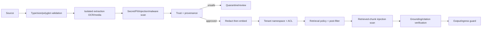
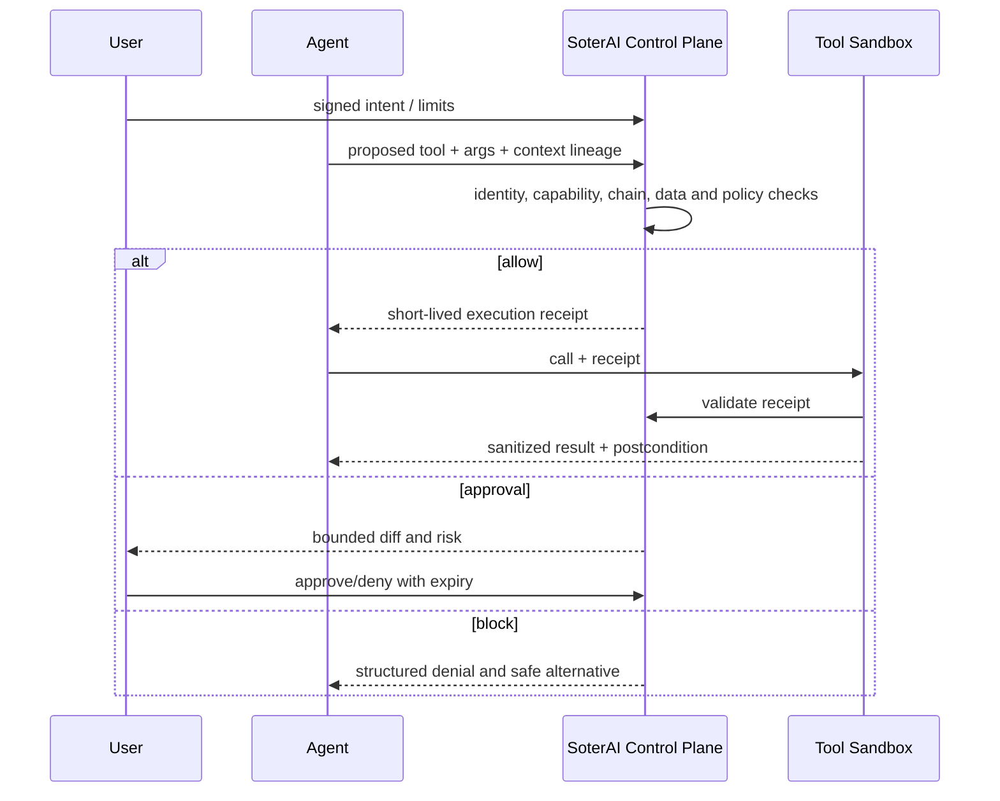

# RAG and Agent Security Plan

## RAG control lifecycle

## RAG upgrades

| Control | Current base | Required improvement | Acceptance test |
|---|---|---|---|
| Ingestion | file validation/OCR/image scan | isolated worker, archive/polyglot/macro limits, content provenance | malicious file fixtures cannot reach indexing |
| Quarantine | status/review/rescan | reason, detector version, reviewer separation and expiry | unsafe docs unavailable until approved |
| Namespace | derived org/project namespace | provider-native auth/filter and optional dedicated collection | two-tenant live Qdrant/pgvector negative suite |
| ACL | chunk ACL and continuity | ACL version on embedding/retrieval; revocation cache invalidation | revoked access disappears within SLO |
| Embeddings | configurable provider | classify/redact before egress; provider allowlist/residency | canary secret never sent to embedding endpoint |
| Retrieval | post-filter/audit | trust-weighted diversity, anomaly and poison dominance checks | ranking manipulation suite |
| Grounding | grounding/citation modules | claim-source mapping and abstention thresholds | unsupported-claim and citation mismatch metrics |
| Lifecycle | rescan route | rescan on detector/policy/source change, tombstone/delete proof | deleted document absent from vectors/backups per policy |

## Agent execution control

## Agent/MCP requirements

- Identity: owner, purpose, environment, status, tool scopes, data classes, domains, expiry and rotation.
- Intent: consequential actions bind to a user-approved goal and constraints.
- Tool trust: signed manifest/snapshot, publisher, version, schema, side effects, credentials and risk.
- Least privilege: read/write/delete/payment/shell/network are separate capabilities.
- Action control: dry-run where possible; approval for high-risk reversible actions; hard block for prohibited actions.
- Execution: sandbox OS/process/network/filesystem; receipt validated at the executor, not only by the agent.
- Output: tool results remain untrusted and are scanned before context or memory.
- Memory: provenance, TTL, quarantine, redaction, version and rollback.
- Chains: cumulative risk, source-to-sink flow, loop/cost budget and cascade breaker.
- Audit: signed trace from intent through proposal, policy, approval, execution and postcondition without hidden chain-of-thought collection.

## Tests

- Malicious MCP description/schema/output, rug pull and lookalike tool.
- Cross-tool exfiltration: private read followed by external write.
- Approval replay, double execution, stale policy and race between revoke/execute.
- Shell/file/network/database/payment sandbox escape attempts.
- Memory poisoning over multiple sessions and cross-agent spoofed messages.
- Agent credential theft and capability escalation.
- Failures of policy, approval, audit and sandbox dependencies.
- No test or feature should attempt to expose private model chain of thought; record structured decisions and supplied rationale only.
