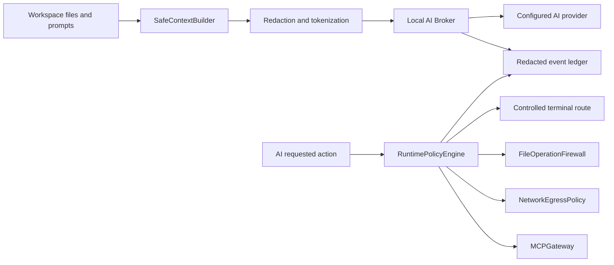

# SoterAI IDE Guard Data Flow

Date: 2026-07-22

## Protected flow

When data uses a SoterAI-supported path, the data flow is local-first:

- Context is classified before use.
- Known secrets and PII are redacted or tokenized before model/provider use.
- Brokered credentials are injected locally and are not returned to the model.
- Terminal, file, network, and MCP decisions are deterministic when routed through the new guard-core policy modules.
- Ledger output stores hashes, categories, reason codes, and redacted evidence, not raw secrets.

## Non-protected flow

SoterAI cannot prove or block data sent by unsupported paths:

- Raw VS Code integrated terminals.
- External terminals and shells.
- Other VS Code extensions making their own network calls.
- OS processes reading plaintext files.
- MCP tool traffic not routed through the SoterAI gateway.
- Browser or cloud sessions outside SoterAI instrumentation.

Those paths must be labelled `DETECTION_ONLY`, `PARTIAL_VISIBILITY`, `UNSUPPORTED`, or `UNKNOWN_NOT_TESTED`.
