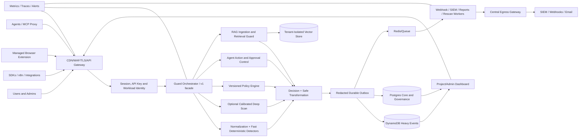
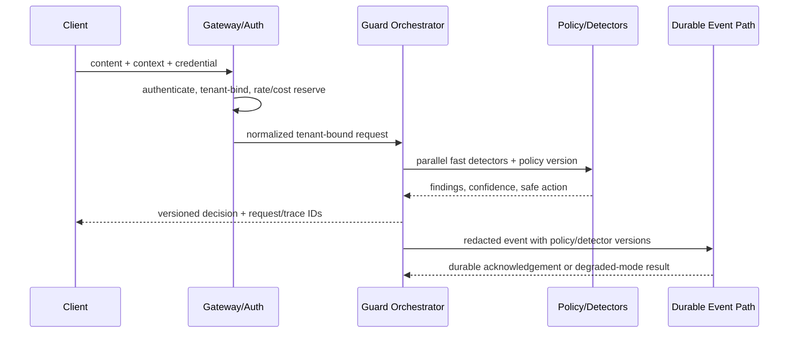

# Target Architecture: AI Security Platform

## Logical architecture

## Request data flow

## Trust boundaries

1. Internet to edge: untrusted bytes, identity and rate claims.
2. Edge to application: only authenticated or explicitly public/rate-limited traffic.
3. Tenant boundary: organization/project derived from credential, never trusted from request alone.
4. Content-to-instruction boundary: user, RAG, web, tool and agent content remains tainted data.
5. Model boundary: provider is an external processor; redact/classify before egress.
6. Tool boundary: model output is a proposal, not authorization; every action is independently checked.
7. Storage boundary: core records in Postgres, high-volume redacted events in DynamoDB, vectors under provider-native tenant isolation.
8. Worker/egress boundary: all outbound destinations revalidated through one policy and network path.
9. Admin boundary: break-glass global access is strongly authenticated, time-bound and immutably audited.

## Tenant isolation model

- Credential establishes `organizationId`, `projectId`, actor, scopes and policy version.
- Request body IDs are checked against that context; a mismatch returns a non-enumerating denial.
- Every core query includes tenant/project criteria; sensitive tables add Postgres RLS where feasible.
- Vector namespace is derived server-side from organization + project, enforced again by provider credentials/filter.
- Cache keys, queues, idempotency keys, object storage prefixes, metrics and events include tenant scope.
- Background jobs carry a signed/scoped tenant envelope and reauthorize before mutation.
- Admin cross-tenant access requires a reason, expiry and append-only audit event.

## Threat model

| Threat actor/path | Asset | Control | Remaining concern |
|---|---|---|---|
| External attacker with crafted prompt | model behavior, tools, data | normalization, detectors, policy, action boundary | adaptive bypass/FP tradeoff |
| Stolen API key | tenant quota/data | hashed key, project binding, rate limit, rotation | scopes/IP/anomaly maturity |
| Malicious document/web page | RAG/agent context | provenance, scan, quarantine, taint | multimodal and semantic bypass |
| Compromised tool/MCP server | credentials/actions | registry, drift, allowlist, output scan | attestation and sandbox enforcement |
| Tenant user/insider | customer data/policy | RBAC, audit, approvals | separation of duties/UEBA |
| Compromised worker/provider | events/secrets | least privilege, egress, redaction | external assurance and key lifecycle |
| Supply-chain attacker | build/runtime | lockfile, future SCA/SBOM/signing | CI gates currently incomplete |

## Failure and rollback design

- Use immutable versioned policies/detectors with last-known-good cache and signature.
- Use transactional outbox or equivalent durable handoff; never claim an audit event exists before durability.
- Feature flags are tenant-scoped and default monitor-only for new detectors.
- Deploy images by digest with canary health and automated rollback.
- Database changes are expand/migrate/contract; old app version remains compatible during rollback.
- Dynamo cutover keeps dual-write and read fallback until reconciliation is green for the agreed window.
- High-risk actions fail closed if identity, policy, approval, or audit prerequisites are unavailable.

## Deployment path

**Now (EC2/Docker):** private VPC subnets for data services, public ALB/WAF/TLS only, app and workers in private network, Security Groups with explicit edges, IAM roles instead of static AWS keys, encrypted EBS/RDS/Dynamo/KMS, backups and restore drill, CloudWatch/OpenTelemetry, deploy by signed digest.

**Next (ECS):** separate app and worker services, autoscaling on latency/queue lag, task IAM roles, secrets manager, private service discovery, blue/green deployment.

**Later (Kubernetes/serverless where justified):** network policy, workload identity, admission policy, signed-image enforcement, per-tenant private deployment option. Do not move merely for branding; move when scaling/isolation/SLO evidence requires it.
