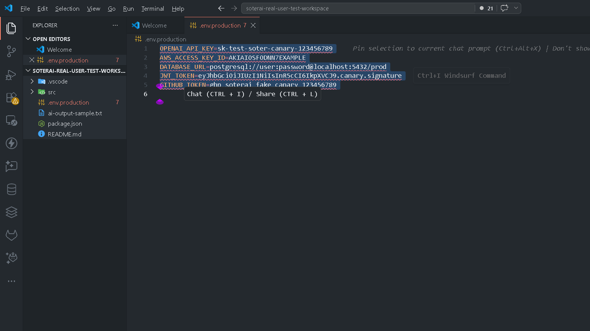
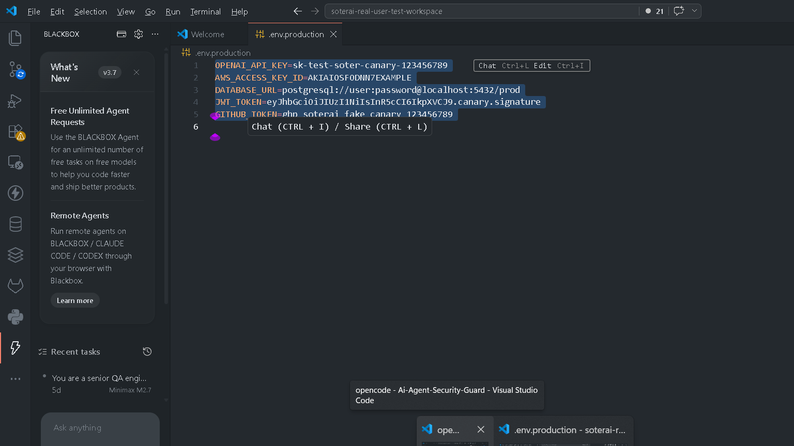
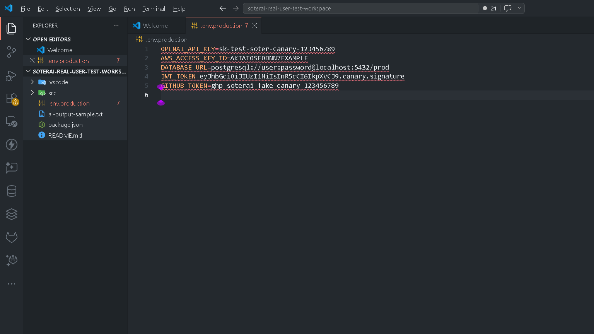

# SoterAI IDE Guard

**Local-first AI security guard for VS Code.** SoterAI IDE Guard scans code,
selections, terminal commands, git changes, and AI prompts for secrets, PII,
prompt injection, and insecure AI-generated code - entirely on your machine.
Nothing leaves your computer unless you explicitly connect to SoterAI Cloud.

[Website](https://soterai.in) ·
[Docs](https://soterai.in/vscode-ai-security) ·
[Support](https://soterai.in/support) ·
[Report an issue](https://github.com/yashchauhan66/Soter-AI/issues) ·
[Source](https://github.com/yashchauhan66/Soter-AI)

The same links are in the Control Panel footer inside the editor.

## Install

**Fastest way — one-click for any IDE:** open the [SoterAI install page](https://soterai.in/extensions/ide), pick your editor (VS Code, Cursor, Windsurf, Kiro, Antigravity, VSCodium), and it opens directly in the editor with a guided redirect and fallbacks.

> **Search in your IDE** — open the Extensions view (`Ctrl+Shift+X`) and search for the extension name: **"SoterAI IDE Guard"** (shown in VS Code as **SoterAI IDE Guard — Local AI Security**, publisher `soterai`, extension ID `soterai.soterai-ide-guard`), then press **Install**.

Or install without leaving your editor:

- **VS Code** — [Install in VS Code](vscode:extension/soterai.soterai-ide-guard) · press `Ctrl+P` and paste `ext install soterai.soterai-ide-guard` · [Marketplace page](https://marketplace.visualstudio.com/items?itemName=soterai.soterai-ide-guard)
- **VSCodium / Eclipse Theia / OpenVSCode Server** — search `soterai` in Extensions (these editors read the [Open VSX registry](https://open-vsx.org/extension/soterai/soterai-ide-guard) directly)
- **Any editor (offline/manual)** — download the `.vsix` from [Open VSX](https://open-vsx.org/extension/soterai/soterai-ide-guard) and run **Extensions → Install from VSIX...**

> **Not showing up in IDE search yet?** Marketplace mirrors and IDE search caches can lag a few hours after a new release, and brand-new extensions rank below established ones for generic keywords. Search by the exact publisher name `soterai`, or use the direct routes above — they work immediately.

## Start in under a minute

1. Run **SoterAI: Run Safe Demo Scan** to see a real verdict using safe built-in test data.
2. Run **SoterAI: Protect Workspace Secrets** to review sensitive files and replace approved values with safe placeholders on disk.
3. Run **SoterAI: Secure Installed AI Tools (One Click)** to review supported AI client routing changes. Every approved change has an encrypted backup and can be undone with **SoterAI: Undo AI Tool Security Changes**.

Local scanning is already on after installation. No account, API key, or cloud connection is required for these first steps.

## In VS Code

Real captures from the VS Code extension-host verification flow. They use test data only.

### Secret finding with a safe copy



### Scan selected text before it reaches AI



### Local request protection enabled



## Features

- **Control Panel** - one sidebar view with instant-apply toggles for Safe Mode, Protected Workspace, Live Scan, Sentinel, and the MCP firewall, plus Emergency Lockdown. Every control states in plain language what it does, and each coverage badge is resolved from the capability registry — a protection is only labelled `ENFORCED` when it is actually broker-gated, otherwise `MONITORED`.
- **Secure My AI (one click)** - finds the AI tools already installed (Cline, Claude Code, Copilot, Continue, Aider, and generic `.env` / shell profiles) and routes them through the local broker so prompts are scanned before they leave. Every rewritten file is backed up first, encrypted, outside your workspace — and `SoterAI: Undo AI Tool Security Changes` puts every original back in one click.
- **Scan Current File / Selection / Workspace** - detect leaked secrets, PII, prompt injection, unsafe instructions, and risky patterns with a redacted report.
- **Live inline scanning + Quick Fixes** - supported files are scanned as you type; findings appear as native diagnostics with lightbulb fixes (redact in place, copy a safe version of the line, move secrets to the vault).
- **Redact Selection for AI** - copy a safe version of selected text before using it in an AI assistant. Raw secrets are not copied.
- **Scan Before AI Prompt** - paste a prompt, scan it locally, and get an allow / redact / block verdict plus a safe prompt to copy.
- **AI Egress Firewall** - one local choke point for anything you are about to send to an AI tool: `ALLOW` / `REDACT` / `ASK` / `BLOCK`, with a redacted copy offered when secrets are present. Re-runs the detectors over **de-obfuscated** variants (zero-width unicode, homoglyphs, leetspeak, letter-spacing, reversal, base64), so smuggled injection that slips past a single-pass regex still scores. Also destination-aware: content heading to a non-allowlisted host escalates, and secret-bearing content heading to a **vector database** is blocked outright because an embedded leak is durable, not transient.
- **Git pre-commit secret hook** - installs a hook that blocks a commit containing secrets. Refuses to install (with an explanation) when `core.hooksPath` is set by husky/lefthook rather than writing to a directory git ignores, and backs up any existing hook.
- **Screen-share risk check** - warns when files that would expose secrets on a shared screen are open, matching on basename and on credential directories (`.ssh`, `.aws`, `.gnupg`, `.kube`, `.docker`) and key material.
- **Scan Git Changes** - scan staged and unstaged diffs for secrets and sensitive files before commit.
- **Check Terminal Command** - flag destructive, remote-exec, credential-exposing, or suspicious shell commands before you run them.
- **Review Selected AI Code** - surface likely vulnerabilities in AI-generated code inside a hardened webview.
- **Local AI Broker** - authenticated loopback-only OpenAI/Anthropic-compatible routing with request/response scanning, redaction, canary blocking, and **SSE streaming** (`stream: true`) with scan-before-forward output protection.
- **Secret Broker** - replaces raw secrets with scoped `soterai://secret/...` references so AI sees structure and approved operations, not values.
- **AI Safe Mode** - Developer, Strict, and Enterprise protection overlays for SoterAI-routed workflows.
- **AI Memory Inspector** - hashes, decisions, redacted evidence, and file metadata showing what SoterAI brokered or built for AI.
- **Security Dashboard** - risk score, latest findings, privacy mode, policy status, and local secret privacy proof.

## Privacy & Security

- **Local-first by default.** Detection, redaction, policy checks, and secret reference creation run locally in the extension host.
- **No raw secrets leave the extension by default.** Reports, webviews, telemetry, logs, clipboard output, hash caches, broker records, and exported views are designed to avoid raw secret material.
- **Secret broker privacy proof.** `SoterAI: Local Privacy Status`, `SoterAI: Preview What AI Will See`, and `SoterAI: What Stays Local?` explain what stays local without displaying raw secrets.
- **Redacted, opt-in telemetry only.** Telemetry is off by default. When enabled, it uses minimized event metadata, not raw content or tokens.
- **Cloud tokens stay in VS Code SecretStorage.** Provider and cloud credentials are stored locally through VS Code's secret APIs and are never logged.
- **Config backups are encrypted and kept out of your workspace.** When "Secure My AI" rewrites a config, the pre-rewrite copy is encrypted (AES-GCM, key in VS Code SecretStorage) and stored in the extension's global storage — never as a plaintext sibling file that `.gitignore` would miss. If the backup cannot be written, the rewrite does not happen.
- **A repository cannot turn its own protection off.** The 25 safety-relevant settings are `machine`-scoped and declared as restricted in untrusted workspaces, so a checked-in `.vscode/settings.json` cannot disable a guard or repoint the broker at another endpoint.

### What Leaves Your Machine?

| Data | Local mode default | Cloud/hybrid with explicit setup |
| --- | --- | --- |
| Raw API keys, tokens, private keys, `.env` values | Never sent | Never sent by default; secret broker uses scoped references |
| Raw file contents and prompts | Never sent | Redacted/minimized checks only unless you explicitly enable a trusted cloud feature |
| Telemetry | Off | Redacted metadata only, controlled by `soterai.telemetry.redactedEvents` |
| Vaulted secrets | Stored locally through VS Code `SecretStorage` / encrypted vault | Not uploaded by SoterAI IDE Guard |
| AI context | Redacted text, hashes, metadata, and secret references | Same local-first contract unless a trusted cloud feature is explicitly configured |

Use `SoterAI: Local Privacy Status` anytime to show a user-safe report that contains no API keys, prompts, secrets, raw files, private keys, database URLs, or PII.

## Workspace Trust

The extension declares **limited** untrusted-workspace support:

| Capability | Trusted workspace | Restricted workspace |
| --- | --- | --- |
| Local scanning and redaction | yes | yes |
| Cloud connect / token storage | yes | disabled |
| Remote scan escalation | yes | disabled |

Local scanning always works. Cloud, token, and remote features are gated behind a trusted workspace and surfaced clearly in the dashboard.

## Commands

| Command | Purpose |
| --- | --- |
| `SoterAI: Open Control Panel` | The single screen: every protection toggle, honest coverage badges, and Emergency Lockdown. |
| `SoterAI: Quick Start` | Choose a value-first next step: demo scan, workspace secret protection, AI-tool routing, or the local privacy promise. |
| `SoterAI: Check Extension Health` | Show version, privacy mode, token configured yes/no, workspace trust, policy status, and last scan without secrets. |
| `SoterAI: Local Privacy Status` | Show the local-only privacy proof without raw secrets, prompts, files, or PII. |
| `SoterAI: What Stays Local?` | Explain exactly what SoterAI does not receive by default. |
| `SoterAI: Preview What AI Will See` | Show the redacted AI context before copying or sending it. |
| `SoterAI: Build Safe Prompt for AI` | Convert sensitive context into a safe prompt with secret references. |
| `SoterAI: Open Settings` | Open VS Code settings filtered to SoterAI. |
| `SoterAI: Run Safe Demo Scan` | Run a safe local demo against fake risky text. |
| `SoterAI: Scan Selection` | Scan selected prompt/text before sending it to an AI assistant. |
| `SoterAI: Scan Before Sending to AI` | Run the egress firewall over the selection (or clipboard) and get an allow / redact / ask / block decision before you paste into any AI chat. |
| `SoterAI: Scan Current File` | Scan the active file for secrets, PII, prompt injection, unsafe instructions, and insecure patterns. |
| `SoterAI: Scan Git Changes` | Scan staged and unstaged git changes locally. |
| `SoterAI: Scan MCP Configs` | Review MCP and agent tool configuration for broad or dangerous permissions. |
| `SoterAI: Check Terminal Command` | Review a command before running it; SoterAI never executes it. |
| `SoterAI: Install Git Pre-Commit Secret Hook` | Block commits containing secrets. Refuses (and explains) when husky/lefthook owns `core.hooksPath`. |
| `SoterAI: Check Screen-Share Risk` | Warn about open files that would expose secrets on a shared screen. |
| `SoterAI: Open Report` | One list of every local report — coverage, what AI saw, agent tool permissions, risk score — with a one-line description each. |
| `SoterAI: Open AI Access Ledger` | View privacy-preserving local scan/share metadata. |
| `SoterAI: Generate Local Canary Secret` | Create a fake canary token for leak detection tests. |
| `SoterAI: Apply Policy Pack` | Apply a built-in policy profile. |
| `SoterAI: Emergency Lockdown (Revoke All Capabilities)` | Revoke everything at once; `SoterAI: Unlock Protection After Lockdown` reverses it, and the panel offers it as the primary action while locked. |

The palette shows the core workflows by default. Older command names still work —
they stay registered for keybindings, tasks and other extensions — but they no
longer occupy a second palette row next to the command they forward to, and the
individual report commands are now listed inside `SoterAI: Open Report`. Enable
`soterai.showAllCommands` to see the full advanced surface.

## Where SoterAI appears while you work

You do not have to remember to open the Command Palette. The checks are on the
surfaces where the risk actually happens:

| Where | What you get |
| --- | --- |
| Right-click a selection in the editor → **SoterAI** | Scan Selection, Scan Before Sending to AI, Redact Selection for AI, Review Selected AI Code |
| Right-click a file in the Explorer → **SoterAI** | Scan File, Add File to Protected List |
| Source Control view toolbar | Scan Git Changes before you commit |
| SoterAI Guard sidebar toolbars | Scan Workspace Risk, Open Settings, Getting Started |
| `Ctrl+Alt+V` / `Cmd+Alt+V` | Safe Paste — scans the clipboard, then pastes the safe version |
| `Ctrl+Alt+S` / `Cmd+Alt+S` | Scan Before Sending to AI — checks the selection, or the clipboard if nothing is selected |

Both keybindings only apply while an editor has focus, so they never shadow a
shortcut you use elsewhere in VS Code.

## Your AI agent can ask SoterAI before it acts

SoterAI contributes three tools an AI agent can call, so the check happens inside
the agent's own loop instead of in a sidebar the agent cannot see:

| Tool | What it answers |
| --- | --- |
| `soterai_scan_text` | Does this text contain secrets, prompt injection or a jailbreak attempt? Returns a redacted copy when it holds a secret. |
| `soterai_check_command` | Is this shell command destructive or credential-stealing? |
| `soterai_check_dependency` | Is this package a typosquat, unpinned, or installed by piping a download into a shell? |

In VS Code chat and Copilot agent mode they appear as tools automatically. Other
MCP clients get the same three from a bundled MCP server, which VS Code offers to
agent mode without you editing any config.

**These tools are advisory.** They answer questions an agent chooses to ask.
SoterAI cannot force an agent to ask, and no extension API lets it intercept what
an agent does on its own — so every result states that limit in full rather than
implying the action was blocked.

They need a recent editor. SoterAI keeps its VS Code `^1.85.0` floor so Cursor,
Windsurf, Kiro and Antigravity stay supported, and on a host without the language
model tool API it registers nothing instead of pretending.
`SoterAI: Show Runtime Capability Summary` reports which surfaces are live on the
editor you are actually using.

## Settings

| Setting | Default | Description |
| --- | --- | --- |
| `soterai.privacyMode` | `local` | `local`, `cloud`, or `hybrid`. Local mode uses local detectors only. |
| `soterai.cloud.enabled` | `false` | Enables configured cloud features in trusted workspaces only. |
| `soterai.cloud.baseUrl` | `https://api.soterai.in` | Cloud API base URL. |
| `soterai.policy.mode` | `local` | Local/team/enterprise policy mode. |
| `soterai.scan.remoteEscalation` | `never` | Remote escalation mode for redacted/minimized high-risk scans. |
| `soterai.scan.maxFileSizeKb` | `256` | Maximum file size for local scans. |
| `soterai.scan.maxWorkspaceFiles` | `1000` | Maximum files checked during workspace scans. |
| `soterai.scan.excludeGlobs` | common build/binary folders | Patterns excluded from workspace scans. |
| `soterai.dependencyGuard.osvMode` | `ask` | `ask` / `always` / `never` — whether Dependency Guard may query public OSV (`api.osv.dev`) for package name+version advisories. Heuristics always run locally. Advisory only. |
| `soterai.liveScan.enabled` | `true` | Inline VISIBILITY_ONLY diagnostics (regex/heuristic; no ML in the VSIX). |
| `soterai.protection.enabled` | `true` | Master switch for the central protection state. |
| `soterai.sentinel.enabled` | `false` | AI activity sentinel; `soterai.sentinel.retentionDays` bounds local retention. |
| `soterai.mcpFirewall.strictMode` | `false` | Stricter verdicts for MCP / agent tool configuration. |
| `soterai.broker.port` | `47321` | Loopback port for the local AI broker. |

Settings that can disable a protection or change where your data goes are
**machine-scoped**: they are read from your user/machine settings only, and a
value set in a repository's `.vscode/settings.json` is ignored. Scan budgets
(`maxFileSizeKb`, `maxWorkspaceFiles`, `excludeGlobs`) and palette visibility
stay workspace-configurable, because none of them can weaken a guard.

## Supported Files


SoterAI focuses on developer text formats: JavaScript, TypeScript, Python,
Markdown, MDX, text, JSON, YAML, `.env`-style files, MCP configuration, and
agent prompt/config files. Binary files and oversized files are skipped.

## API Key Setup

Cloud and broker provider tokens are stored with VS Code `SecretStorage`. Use
`SoterAI: Connect to SoterAI Cloud` or the broker configuration commands only
in trusted workspaces. Local privacy mode does not require an API key and does
not make network calls.

## Troubleshooting

- If commands do not appear, run `SoterAI: Quick Start` from the Command Palette.
- If a file is skipped, check `soterai.scan.maxFileSizeKb` and exclude globs.
- If cloud setup is disabled, verify VS Code Workspace Trust is enabled.
- If the VSIX was installed manually, reload VS Code after installation.

## Known Limitations

- Detection is defense-in-depth, not a guarantee that every issue will be found. Detectors are **regex/heuristic** in the packaged extension — no ONNX/ML model ships in the VSIX.
- **Live scan** is `VISIBILITY_ONLY`: squiggly diagnostics after content exists; it does not block send-to-AI or other extensions.
- **Terminal review** is `DETECTION_ONLY` unless you use the broker **controlled terminal** allowlist route (`STRONG_ENFORCEMENT` for fixed-argv read-only commands only).
- **MCP and extension risk analysis** is config/metadata heuristic (`DETECTION_ONLY`). The MCP gateway engine exists in guard-core but is **not wired** into the packaged extension (`UNKNOWN_NOT_TESTED` until routed).
- **DepGuard** is `DETECTION_ONLY`: local heuristics always; optional online OSV advisory lookup (`soterai.dependencyGuard.osvMode`) with explicit consent. Not a full SCA product; cannot block installs outside SoterAI-reviewed commands.
- **Broker streaming** is `STRONG_ENFORCEMENT` only for traffic routed through the loopback broker. Partial tokens already flushed before a late block cannot be recalled (honest residual risk).

- Full cloud telemetry submission is disabled until a reviewed endpoint client is added.
- SoterAI Guard is not a replacement for professional security review, secure SDLC, or incident response.
- Universal claims (full terminal/MCP/network enforcement for arbitrary agents) are **UNSUPPORTED** without an OS-level broker/sandbox.


## Development

```bash
npm run typecheck   # tsc --noEmit
npm run lint        # eslint
npm run test        # node --test static manifest/contract tests
npm run bundle      # extension + standalone local broker bundles
npm run package     # bundle + vsce package -> .vsix
```

The extension is bundled with esbuild into a single `dist/extension.js`
(with `@soterai/guard-core` inlined) so the packaged VSIX stays small and never
follows the symlinked monorepo.

## License

See [LICENSE](./LICENSE) (Business Source License 1.1). Copyright SoterAI.
